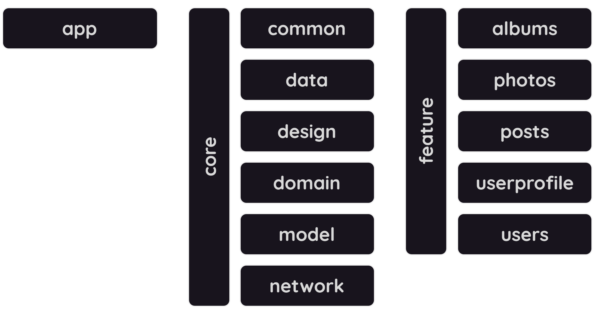

## API-Request

<b>API-Request</b> is a simple showcase app that makes HTTP requests, built with `Kotlin`
and `Jetpack Compose`.

API used in this project is [JSON Placeholder](https://jsonplaceholder.typicode.com).

### Architecture

<b>API-Request</b> is based on multi-module project and
uses [Version Catalog](gradle/libs.versions.toml).

The modularization guide can be found in
the [official documentation](https://developer.android.com/topic/modularization).

### Resources

<b>API-Request</b> has examples of implementations with `Ktor` + `Kotlinx Serialization`
and `Retrofit` + `Gson` for HTTP requests. The usage between them can be changed individually in
each [use case](core/domain/src/main/kotlin/tmidev/apirequest/core/domain/usecase).

The `Material Icons Extended` library is present in the project, so using the `debug build`
will result in a large app size.

The `release build` is being signed with debug key just to be able to run
the [build release apk workflow](.github/workflows/build_release_apk.yml) in a simple way.

### Screen Features

- `Users Screen`: [users endpoint](https://jsonplaceholder.typicode.com/users) request is made here,
  a list of users should be displayed if the connection is successful. The user in the list can be
  clicked on, to then be navigated to a screen where it will be possible to see more information
  about him.
- `User Profile Screen`: [user endpoint](https://jsonplaceholder.typicode.com/users/1)
  referring to the user id is made here, some data should be displayed and will then be possible to
  navigate to a screen for viewing the posts or albums of that user if the connection is successful.
- `Posts Screen`: [posts endpoint](https://jsonplaceholder.typicode.com/posts?userId=1) for the user
  id is made here, a list of posts should be displayed if the connection is successful.
- `Albums Screen`: [albums endpoint](https://jsonplaceholder.typicode.com/albums?userId=1) for the
  user id is made here, a list of albums should be displayed if the connection is successful. The
  album in the list can be clicked on, to then be navigated to a screen where all the photos in the
  album will be displayed.
- `Photos Screen`: [photos endpoint](https://jsonplaceholder.typicode.com/photos?albumId=1) for the
  album id is made here, a grid list of photos should be loaded if the connection is successful.

---

Download available on [Play Store](https://play.google.com/store/apps/details?id=tmidev.apirequest).
